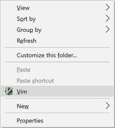

# gvim-start-menu (for Windows)

Provides the menu that can start Vim on current directory, unlike "Edit with
Vim" set up by common installer.

Run `install.exe` or `uninstall.exe` to set up.
UAC prompt will appear on demand, so do not have to run as Administrator.

Note that `gvim` command must be installed on your machine and `%PATH%` before
run this script.

Tested on Windows 10 (x64) and Vim 8.0

## License

CC0 License

Authored by Retorillo, No Rights Reserved.
